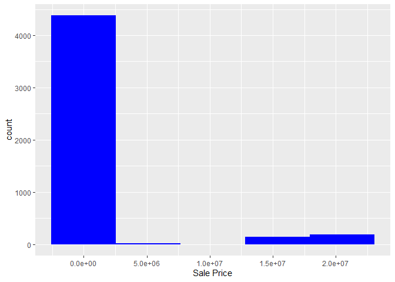
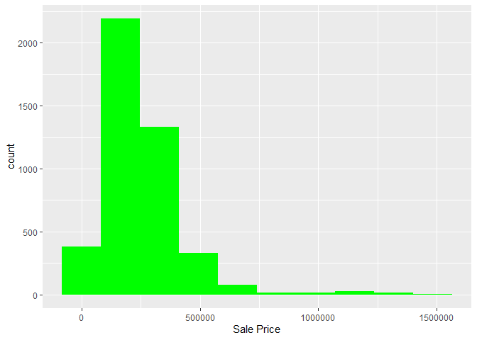
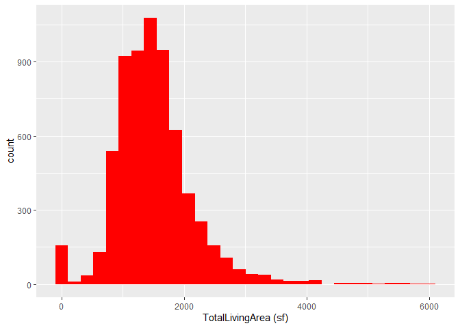
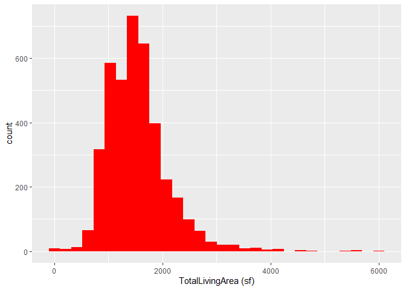
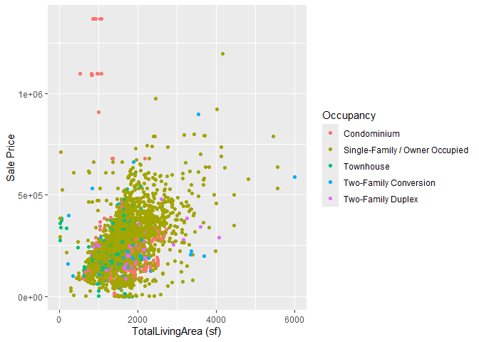

<!-- README.md is generated from README.Rmd. Please edit the README.Rmd file -->

# Lab report \#1

Follow the instructions posted at
<https://ds202-at-isu.github.io/labs.html> for the lab assignment. The
work is meant to be finished during the lab time, but you have time
until Monday evening to polish things.

Include your answers in this document (Rmd file). Make sure that it
knits properly (into the md file). Upload both the Rmd and the md file
to your repository.

All submissions to the github repo will be automatically uploaded for
grading once the due date is passed. Submit a link to your repository on
Canvas (only one submission per team) to signal to the instructors that
you are done with your submission. \##TL:DR

Filtered and cleaned the dataset, identified Sale Price as the main
variable, and found that most homes sell between \$200K–\$400K. Living
area and sale price show a weak positive correlation (0.31), likely due
to skewness in the data.

# Data Analysis

As a team, we found that the data set contains 16 columns and 6,935 rows
of data. It contains information on houses sold in Ames from 07-03-2017
to 08-31-2022.

The dataset contains 16 variables:

- **Parcel ID**: categorical — unique identifier for each property
- **Address**: categorical — street address of the property
- **Style**: categorical — architectural style of the home (12 types)
- **Occupancy**: categorical — type of occupancy (5 types)
- **Sale Date**: categorical — date the property was sold
- **Sale Price**: numeric — sale price in dollars
- **Multi Sale**: categorical — indicates if part of a multi-property
  transaction
- **YearBuilt**: numeric — year the home was constructed
- **Acres**: numeric — lot size in acres
- **TotalLivingArea (sf)**: numeric — total finished living area in
  square feet
- **Bedrooms**: numeric — number of bedrooms
- **FinishedBsmtArea (sf)**: numeric — finished basement area in square
  feet
- **LotArea (sf)**: numeric — lot size in square feet
- **AC**: categorical — whether the home has air conditioning (Yes/No)
- **FirePlace**: categorical — whether the home has a fireplace (Yes/No)
- **Neighborhood**: categorical — neighborhood in Ames (42 types)

``` r
library(tidyverse)
```

    ## ── Attaching core tidyverse packages ──────────────────────── tidyverse 2.0.0 ──
    ## ✔ dplyr     1.1.4     ✔ readr     2.1.5
    ## ✔ forcats   1.0.1     ✔ stringr   1.6.0
    ## ✔ ggplot2   4.0.0     ✔ tibble    3.3.0
    ## ✔ lubridate 1.9.4     ✔ tidyr     1.3.1
    ## ✔ purrr     1.1.0     
    ## ── Conflicts ────────────────────────────────────────── tidyverse_conflicts() ──
    ## ✖ dplyr::filter() masks stats::filter()
    ## ✖ dplyr::lag()    masks stats::lag()
    ## ℹ Use the conflicted package (<http://conflicted.r-lib.org/>) to force all conflicts to become errors

``` r
library(classdata)
library(dplyr)
library(ggplot2)
str(ames)
```

    ## tibble [6,935 × 16] (S3: tbl_df/tbl/data.frame)
    ##  $ Parcel ID            : chr [1:6935] "0903202160" "0907428215" "0909428070" "0923203160" ...
    ##  $ Address              : chr [1:6935] "1024 RIDGEWOOD AVE, AMES" "4503 TWAIN CIR UNIT 105, AMES" "2030 MCCARTHY RD, AMES" "3404 EMERALD DR, AMES" ...
    ##  $ Style                : Factor w/ 12 levels "1 1/2 Story Brick",..: 2 5 5 5 NA 9 5 5 5 5 ...
    ##  $ Occupancy            : Factor w/ 5 levels "Condominium",..: 2 1 2 3 NA 2 2 1 2 2 ...
    ##  $ Sale Date            : Date[1:6935], format: "2022-08-12" "2022-08-04" ...
    ##  $ Sale Price           : num [1:6935] 181900 127100 0 245000 449664 ...
    ##  $ Multi Sale           : chr [1:6935] NA NA NA NA ...
    ##  $ YearBuilt            : num [1:6935] 1940 2006 1951 1997 NA ...
    ##  $ Acres                : num [1:6935] 0.109 0.027 0.321 0.103 0.287 0.494 0.172 0.023 0.285 0.172 ...
    ##  $ TotalLivingArea (sf) : num [1:6935] 1030 771 1456 1289 NA ...
    ##  $ Bedrooms             : num [1:6935] 2 1 3 4 NA 4 5 1 3 4 ...
    ##  $ FinishedBsmtArea (sf): num [1:6935] NA NA 1261 890 NA ...
    ##  $ LotArea(sf)          : num [1:6935] 4740 1181 14000 4500 12493 ...
    ##  $ AC                   : chr [1:6935] "Yes" "Yes" "Yes" "Yes" ...
    ##  $ FirePlace            : chr [1:6935] "Yes" "No" "No" "No" ...
    ##  $ Neighborhood         : Factor w/ 42 levels "(0) None","(13) Apts: Campus",..: 15 40 19 18 6 24 14 40 13 23 ...

``` r
glimpse(ames)
```

    ## Rows: 6,935
    ## Columns: 16
    ## $ `Parcel ID`             <chr> "0903202160", "0907428215", "0909428070", "092…
    ## $ Address                 <chr> "1024 RIDGEWOOD AVE, AMES", "4503 TWAIN CIR UN…
    ## $ Style                   <fct> 1 1/2 Story Frame, 1 Story Frame, 1 Story Fram…
    ## $ Occupancy               <fct> Single-Family / Owner Occupied, Condominium, S…
    ## $ `Sale Date`             <date> 2022-08-12, 2022-08-04, 2022-08-15, 2022-08-0…
    ## $ `Sale Price`            <dbl> 181900, 127100, 0, 245000, 449664, 368000, 0, …
    ## $ `Multi Sale`            <chr> NA, NA, NA, NA, NA, NA, NA, NA, NA, NA, NA, NA…
    ## $ YearBuilt               <dbl> 1940, 2006, 1951, 1997, NA, 1996, 1960, 2006, …
    ## $ Acres                   <dbl> 0.109, 0.027, 0.321, 0.103, 0.287, 0.494, 0.17…
    ## $ `TotalLivingArea (sf)`  <dbl> 1030, 771, 1456, 1289, NA, 2223, 1165, 658, 13…
    ## $ Bedrooms                <dbl> 2, 1, 3, 4, NA, 4, 5, 1, 3, 4, 4, 2, 2, 3, 2, …
    ## $ `FinishedBsmtArea (sf)` <dbl> NA, NA, 1261, 890, NA, NA, 906, NA, NA, 500, 5…
    ## $ `LotArea(sf)`           <dbl> 4740, 1181, 14000, 4500, 12493, 21533, 7500, 1…
    ## $ AC                      <chr> "Yes", "Yes", "Yes", "Yes", "No", "Yes", "Yes"…
    ## $ FirePlace               <chr> "Yes", "No", "No", "No", "No", "Yes", "Yes", "…
    ## $ Neighborhood            <fct> (28) Res: Brookside, (55) Res: Dakota Ridge, (…

``` r
summary(ames)
```

    ##   Parcel ID           Address                        Style     
    ##  Length:6935        Length:6935        1 Story Frame    :3732  
    ##  Class :character   Class :character   2 Story Frame    :1456  
    ##  Mode  :character   Mode  :character   1 1/2 Story Frame: 711  
    ##                                        Split Level Frame: 215  
    ##                                        Split Foyer Frame: 156  
    ##                                        (Other)          : 218  
    ##                                        NA's             : 447  
    ##                           Occupancy      Sale Date            Sale Price      
    ##  Condominium                   : 711   Min.   :2017-07-03   Min.   :       0  
    ##  Single-Family / Owner Occupied:4711   1st Qu.:2019-03-27   1st Qu.:       0  
    ##  Townhouse                     : 745   Median :2020-09-22   Median :  170900  
    ##  Two-Family Conversion         : 139   Mean   :2020-06-14   Mean   : 1017479  
    ##  Two-Family Duplex             : 182   3rd Qu.:2021-10-14   3rd Qu.:  280000  
    ##  NA's                          : 447   Max.   :2022-08-31   Max.   :20500000  
    ##                                                                               
    ##   Multi Sale          YearBuilt        Acres         TotalLivingArea (sf)
    ##  Length:6935        Min.   :   0   Min.   : 0.0000   Min.   :   0        
    ##  Class :character   1st Qu.:1956   1st Qu.: 0.1502   1st Qu.:1095        
    ##  Mode  :character   Median :1978   Median : 0.2200   Median :1460        
    ##                     Mean   :1976   Mean   : 0.2631   Mean   :1507        
    ##                     3rd Qu.:2002   3rd Qu.: 0.2770   3rd Qu.:1792        
    ##                     Max.   :2022   Max.   :12.0120   Max.   :6007        
    ##                     NA's   :447    NA's   :89        NA's   :447         
    ##     Bedrooms      FinishedBsmtArea (sf)  LotArea(sf)          AC           
    ##  Min.   : 0.000   Min.   :  10.0        Min.   :     0   Length:6935       
    ##  1st Qu.: 3.000   1st Qu.: 474.0        1st Qu.:  6553   Class :character  
    ##  Median : 3.000   Median : 727.0        Median :  9575   Mode  :character  
    ##  Mean   : 3.299   Mean   : 776.7        Mean   : 11466                     
    ##  3rd Qu.: 4.000   3rd Qu.:1011.0        3rd Qu.: 12088                     
    ##  Max.   :10.000   Max.   :6496.0        Max.   :523228                     
    ##  NA's   :447      NA's   :2682          NA's   :89                         
    ##   FirePlace                            Neighborhood 
    ##  Length:6935        (27) Res: N Ames         : 854  
    ##  Class :character   (37) Res: College Creek  : 652  
    ##  Mode  :character   (57) Res: Investor Owned : 474  
    ##                     (29) Res: Old Town       : 469  
    ##                     (34) Res: Edwards        : 444  
    ##                     (19) Res: North Ridge Hei: 420  
    ##                     (Other)                  :3622

# Main Focus

As a team, we found that the sale price of the houses is the most
interesting variable to focus on. This will be the main variable.

Since there are 2206 houses with a sale price of 0, almost a third of
them, we can assume that a sale price of 0 means the house is not sold.

``` r
sum(ames$`Sale Price` == 0)
```

    ## [1] 2206

As a team, we found that to focus on only houses that have sold, we will
filter out houses with a sale price of 0. We will then create a
histogram to see the distribution of house prices.

``` r
sales = filter(ames, `Sale Price` > 0)

ggplot(data = sales, aes(x = `Sale Price`)) + geom_histogram(fill = "blue", bins = 5)
```

<!-- -->

As a team, we found that the histogram is severely right skewed by the
more expensive homes in the 1.5 to 2 million dollar range. The majority
of homes are between 1 and 250,000 dollars. We will filter out the
expensive homes to analyze the majority.

``` r
typical_sales <- filter(sales, `Sale Price` < 1500000)

ggplot(data = typical_sales, aes(x = `Sale Price`)) + geom_histogram(fill = "green", bins = 10)
```

<!-- -->

As a team, we found that from the second histogram, most homes sold are
in the range of 200,000 - 400,000.

# Living Area by Price

As a team, we found that analyzing the living area of the homes may
reveal a relationship between it and sale price.

Since a home cannot have a living area of 0, we will filter them out as
well as any null values.

``` r
typical_sales <- filter(typical_sales, `TotalLivingArea (sf)` > 0)
typical_sales <- filter(typical_sales, !is.na(`TotalLivingArea (sf)`))
```

Next, we will plot a histogram of the total living areas.

``` r
ggplot(data = ames, aes(x = `TotalLivingArea (sf)`)) + geom_histogram(fill="red", bins=30)
```

    ## Warning: Removed 447 rows containing non-finite outside the scale range
    ## (`stat_bin()`).

<!-- -->

As a team, we found that this histogram shows a similar distribution as
price, where the data is right skewed by the larger numbers.

We will check the distribution of total living area for houses under 1.5
million as well.

``` r
ggplot(data = typical_sales, aes(x = `TotalLivingArea (sf)`)) + geom_histogram(fill="red", bins=30)
```

<!-- -->

As a team, we found that this histogram shows a distribution pattern
almost identical to the price histogram referencing the same data. We
will now check the correlation coefficient between the two variables.
First, we will remove null values.

``` r
typical_sales <- typical_sales %>% drop_na(`Sale Price`, `TotalLivingArea (sf)`)
```

Then, find the correlation.

``` r
cor(typical_sales$`Sale Price`, typical_sales$`TotalLivingArea (sf)`)
```

    ## [1] 0.3085509

As a team, we found that the correlation coefficient between sale price
and total living area is 0.31, indicating a positive weak correlation.
This is most probably explained by the skewedness of the data. As price
increases, there are less houses and therefore less data to draw an
accurate conclusion.

We will now plot the variables to visualize this.

``` r
ggplot(data = typical_sales) + 
  geom_point(aes(y = `Sale Price`, x = `TotalLivingArea (sf)`, color = `Occupancy`))
```

<!-- -->

As a team, we found that from the graph, there is a slight increase in
sale price as total living area increases.

# Individual Contributions

Ishan’s work:

- Inspected and described all 16 variables in the dataset
- Identified Sale Price as the main variable of interest
- Discovered and investigated the oddity of 2,206 homes with a sale
  price of 0
- Filtered the data to focus on sold homes and typical sales under
  \$1,500,000
- Created histograms for Sale Price and TotalLivingArea distributions
- Filtered out invalid living area values (0 and NA)
- Computed the correlation coefficient between Sale Price and
  TotalLivingArea
- Created a colored scatterplot to visualize the relationship between
  the two variables
